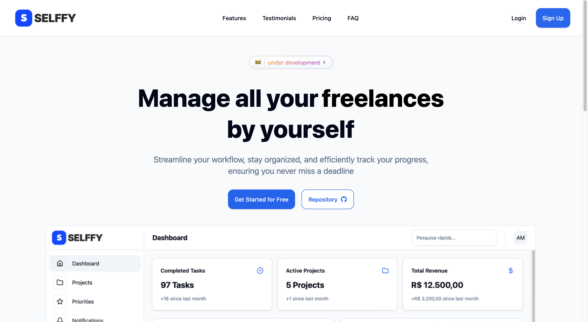

<div style="display: flex; align-items: center; justify-content: start; flex-direction: row; gap: 10px;">
<p align="left">
  
</p>
<h1>
Selffy 
</h1>
</div>



## About
Selffy is a comprehensive platform designed to help you manage all your personal and professional freelance projects seamlessly in one place. With Selffy, you can streamline your workflow, stay organized, and efficiently track your progress, ensuring you never miss a deadline. 

🚧 **Selffy is under development** 🚧

## Dependencies
- [Git](https://git-scm.com/downloads)
- [Node/NPM](https://nodejs.org/)
- [Docker](https://www.docker.com/)

## How to use?
Clone the repository: ```https://github.com/arthurmousinho/selffy.git```

- [Run web app](./web/README.MD)
- [Run AI Model API app](./model/README.MD)
- [Run API](./api/README.MD)

## Documentation Links

- [Architeture Diagram](./docs/arch.tldr) Ps:. You need to have [tldraw extension](https://marketplace.visualstudio.com/items?itemName=tldraw-org.tldraw-vscode) in your vs-code to visualize the diagram
- [Project Features](./docs/features.md)
- [Project Roles Structure](./docs/rbac.md)